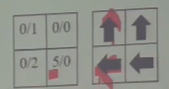

# Martian Mining 

+ 難度：３星
+ 題意：給定一個 n 列 m 行的牌面盤面，每一個行列都會有兩種價值，  1. 只能從左向右、2.只能從下往上，一個格子只能選擇一種移動方向，移動過程也沒辦法轉向，也無法跨越不同方向的格子，印出盤面能夠獲得的最大價值

+ 題意範例：

    

    表格內數字表示左石頭/上石頭的價值。可以看出，為了拿到價值為5的石頭，必須將下面一列的兩個格子都向左，如此一來，左下角格子內價值為2的石頭便無法拿到，因此最大總價值為 1 + 5 = 6 

+ 解法：DP ( Dynamic Programming )。一個格子向左，其左方與下方的所有格子也只能向左；一個格子若向上，其上方與右方的所有格子也只能向上。因此，可以寫出DP式如下：

        dp(i,j) = max { dp(i,j+1) + y(i,j) - y(i,j+1),
                        dp(i+1,j) + b(i,j) - b(i+1,j)}

    dp(i,j)表示從i到n-1列與j到m-1行中所有格子的最大總價值，
    
    y(i,j)表示從i到n-1列與j到m-1行中所有左石頭的價值總和，

    b(i,j)表示從i到n-1列與j到m-1行中所有上石頭的價值總和。

+ 解法範例：

    

    |y(向左)|0|1|2|
    |----|----|----|----|
    |0|11|8|5|
    |1|7|6|5|

    |b(向上)|0|1|2|
    |----|----|----|----|
    |0|12|4|1|
    |1|8|0|0|

        dp(1,2) = {5,0} = 5
        dp(1,1) = {5+6-5,0} = 6    
        dp(1,0) = {6+7-6,8} = 8
        dp(0,2) = {5,5+1-5} = 5
        dp(0,1) = {5+2-0,6+4-0} = 10
        dp(0,0) = {10+11-8,8+12-8} = 13  
        此題範例最大架值為13
    
    (1) 先計算出y與b兩個表格，避免重複計算單列或單行的總和

    (2) 一最佳解必須滿足下列性質：
        
        1.左邊相鄰的行都是向左的格子
        2.上面相鄰的列都是向上的格子
    (3) 輸入規則：題目先輸入ｎ、ｍ表示ｎ列ｍ行，接下來表示ｎ列向上的價值，而後表示ｍ列向左的數值